This guide provides setup requirements and steps to demonstrate how to developer a web application protected by Azure AD using OpenID Connect and OWIN middleware.

Pre-Requisites
--------------

This section lists the pre-requisites required for this demonstration.

-   An Azure subscription

-   Visual Studio 2015

-   Perform the setup requirements for **Demo 1 – App Integration** if you haven’t already.

Setup
-----

*Estimated time: 5 minutes*

1.  Copy the folder **3\_OpenID\_Connect\_WebApp** to **c:\\azurecoe\\demos\\identity**.

2.  Using Visual Studio, open the solution in the folder named **OpenIDConnect.WebApp.Demo.Solution.sln**.

3.  Select **Build &gt; Rebuild Solution**.

4.  Press **Ctrl-F5** to run the application.

    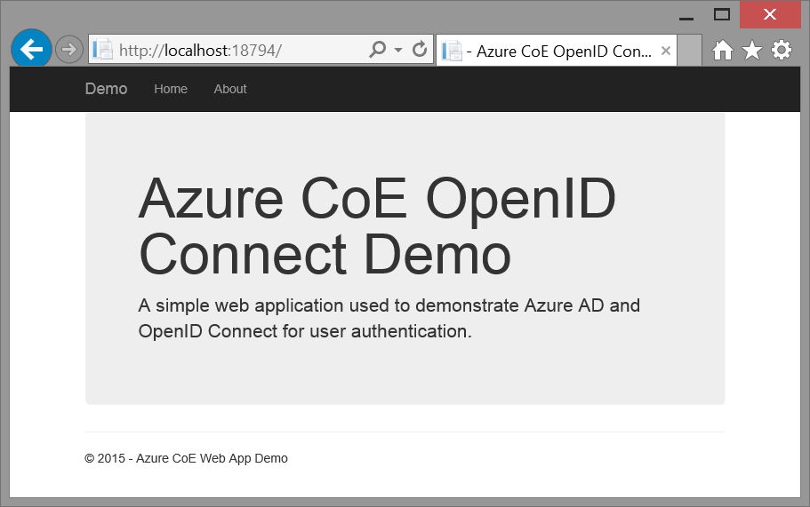

5.  In a separate browser window, open the Azure Management portal at <https://manage.windowsazure.com> and open the **APPLICATIONS** page for the Azure CoE directory.

6.  *Note: In Visual Studio, make sure you are signed-in to your Azure Subscription. The tokens expire daily so you don’t want to have to re-authenticate at the beginning of your dem*

Demo Steps
----------

*Estimated time: 10 minutes*

1.  Show the web application by clicking on the **Home** and **About** links in the menu. Explain that this is just a simple MVC application that currently does not authenticate any users.

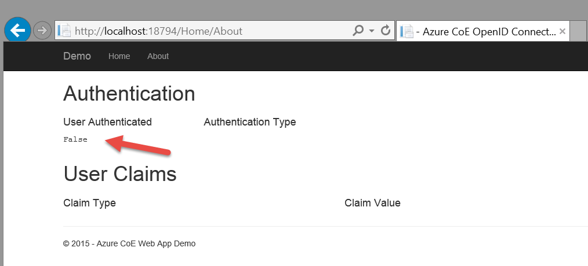

1.  Close the browser.

2.  In Visual Studio, right-click on the project and select **Configure Azure AD Authentication**. Explain that this is a developer tool that simplifies the application registration with Azure AD and the application configuration/code that you described in the presentation just before the demo. This is not the only way to achieve this, but it is probably the easiest given the powerful tooling experience that Visual Studio and the Azure SDK tools can deliver.

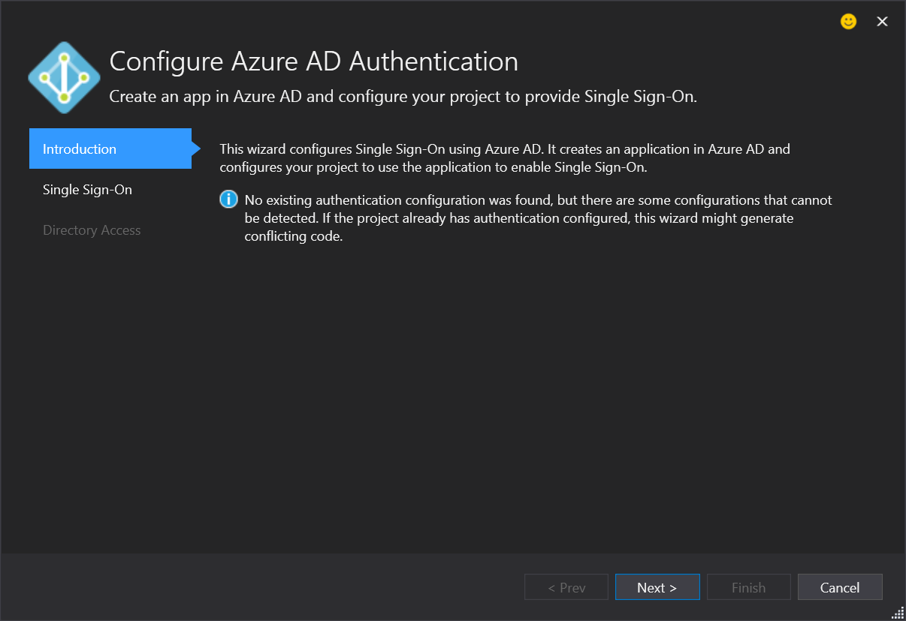

1.  Click **Next**.

2.  Set the **Domain** dropdown field to your Azure CoE directory, which should be **azurecoe01.onmicrosoft.com**. Note: Your domain may be suffixed with a different number but it will be in the list.

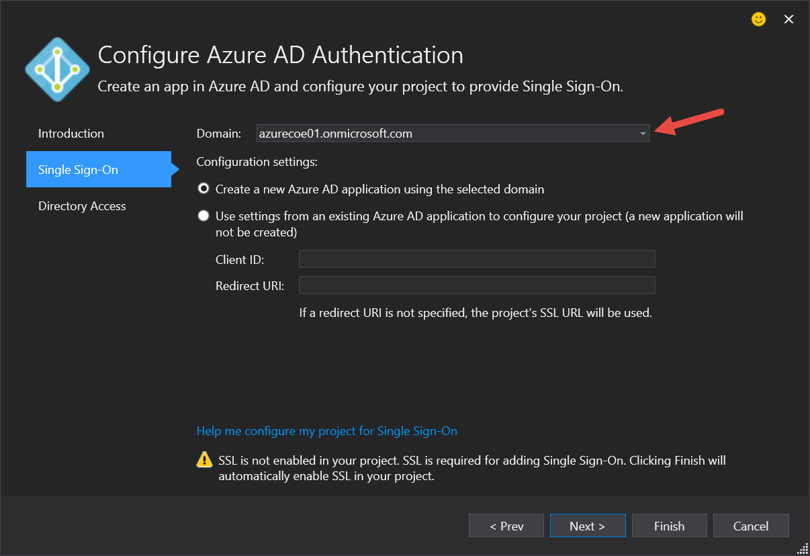

1.  Click **Next**.

2.  Do ***not*** select the option to Read directory data.

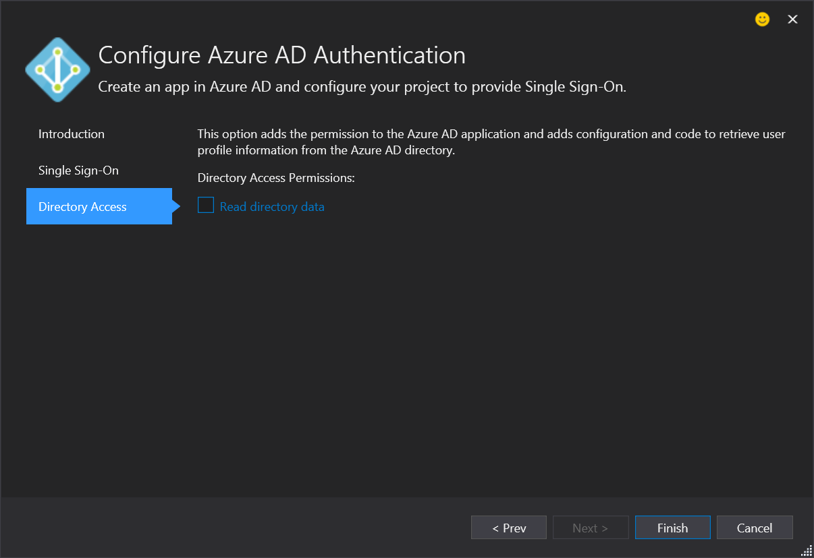

1.  Click **Finish**.

2.  It will take a few seconds for the configuration changes to be applied. While things are scrolling by, explain that the two steps you mentioned in the presentation are being performed right now, which are:

    1.  The application is being registered with Azure AD so that Azure AD knows about it and can issue tokens for it.

    2.  The application is being configured with the code & configuration to externalize authentication to Azure AD. This includes pulling down the OWIN middleware that will protect the web app from unauthenticated access and validate tokens from Azure AD, updating the code with the Authorize attribute, and wiring up the OWIN middleware using the app registration settings in Azure AD.

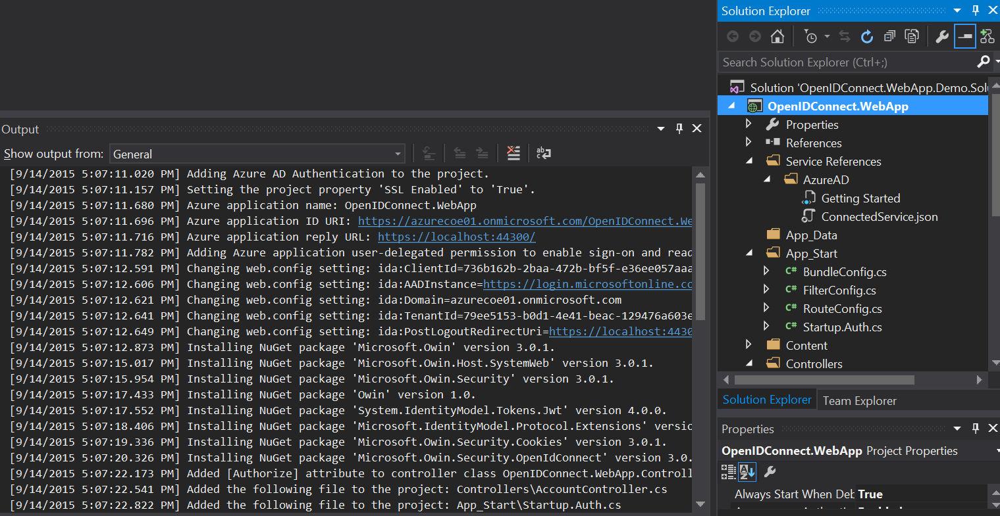

1.  Refreshing the **APPLICATIONS** page in the Azure Management portal to show the **OpenIDConnect.WebApp** has been added.

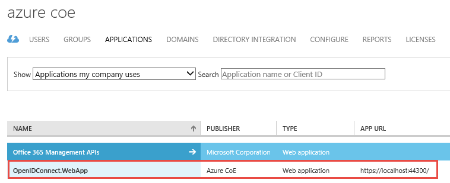

1.  Click on the **OpenIDConnect.WebApp**.

2.  Click on the **CONFIGURE** tab at the top of the page.

3.  Explain the CLIENT ID, which was generated by Azure AD during the application registration process. Also explain the APP ID URI and REPLY URL.

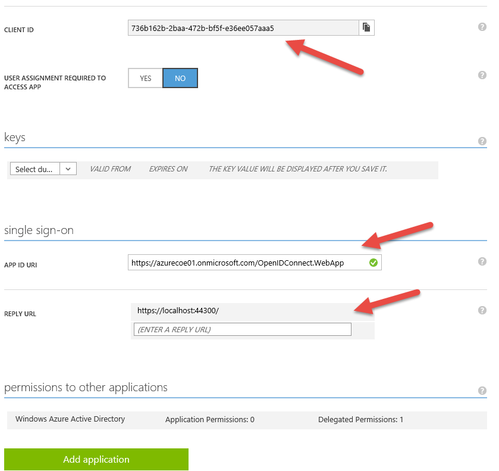

1.  Click the **VIEW ENDPOINTS** button to show the Tenant ID for your directory.

2.  In Visual Studio, open **web.config**.

3.  Show the settings in the application’s web.config that match the settings you showed in the Azure Management portal for the application registered.

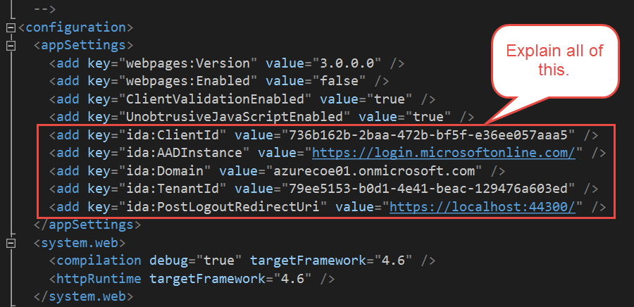

1.  In Visual Studio, open **App\_Start\\Startup.Auth.cs**.

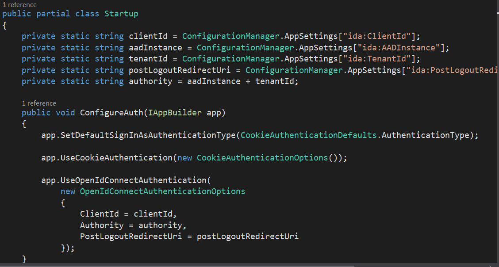

1.  Explain that this is where the configuration settings are pulled in and where the OWIN middleware gets configured. For Web Apps, the OWIN middleware is configured to use OpenID Connect authentication and use a session cookie (typical of many sites) after the user has authenticated.

2.  In Visual Studio, open **Controllers\\HomeController.cs**. Point out the Authorize attribute that was added to the controller. If there were other controllers in the project, they too would have been updated. This is what is used in conjunction with the OWIN middleware to protect this part of the web application. If a user is not authenticated and authorized to view this application, then they won’t be able to access this page.

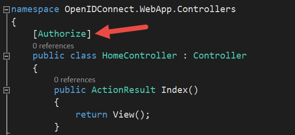

1.  Show the **Controllers\\AccountController.cs** that was added to the project to handle sign-in and sign-out. Explain as much as you think the audience can handle. Or, just say that this was added to the project by the tool and invokes the necessary OWIN functions to support single-sign-on and sign-out.

2.  In Visual Studio, open **Views\\Shared\\\_Layour.cshtml**.

3.  Add **@Html.Partial(“\_LoginPartial”)** as shown in the graphic. Explain that the tool generated this Razor view for us and all we have to do is render the view to provide support for sign-out as well.

1.  Press **Ctrl-F5** from Visual Studio to run the application.

2.  This time the application will not let you in until you authenticate. Sign-in as **john@azurecoe01.onmicrosoft.com** using password **P@ssword1**.

3.  Since this is the first time John is accessing this application, he needs to consent to allow the application to sign him in and read his profile. Azure AD will remember this so that future sign-ins will skip this step.

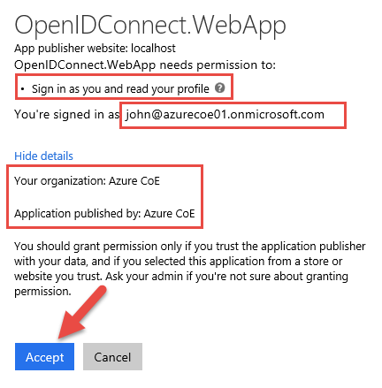

1.  Click **Accept**.

2.  In the demo web app, click the **About** link in the menu.

3.  Show that the user has been authenticated and that the Authentication type is using cookies. The OWIN middleware issued the cookie after validating the security token from Azure AD.

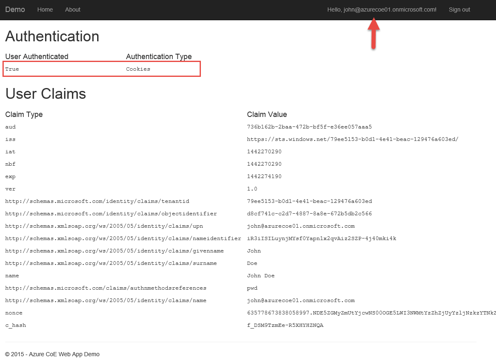

1.  Also point out all the claims that were present in the token for user John.

2.  In Visual Studio, show the **ClaimsPrincipal** where these claims were retrieved from.

3.  Click the **Sign-Out** link at the top of the page.

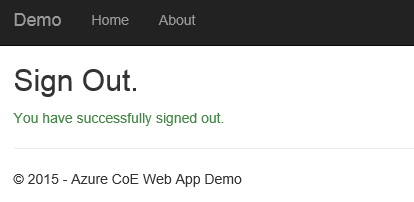

1.  Click **Home** and show that you are prompted to sign-in again. Don’t bother signing in – just show that you cannot back to the app until you do.

    Don’t close this window or IIS Express will unload. Note, this wouldn’t matter if we published to Azure but since it’s running locally you need to make sure the server (IIS Express) doesn’t stop.

2.  Open a new **InPrivate** browser session and navigate to https://myapps.microsoft.com.

3.  Sign-in as **john@azurecoe01.onmicrosoft.com** with password **P@ssword1**.

    Show that the custom demo app has been added to the Access Panel for this directory.

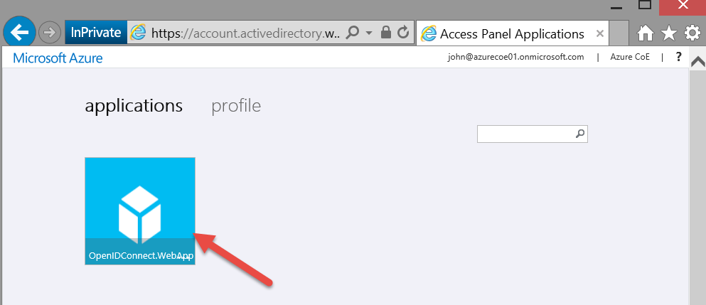

1.  Click the **OpenIDConnect.WebApp** tile in the Access Panel.

2.  Point out that the application is launched automatically and John is signed-in without being challenged. This is because he was already authenticated to the Access Panel.

Clean Up
--------

To clean up after this demo perform the following steps:

1.  In the Azure Management Portal, delete the application that was registered under the name **OpenIDConnect.WebApp**.

2.  Close Visual Studio.

3.  Delete the folder **c:\\azurecoe\\demos\\identity\\ 3\_OpenID\_Connect\_WebApp**.
